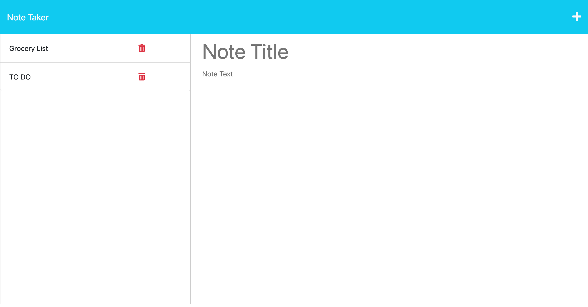

# Note Taker

## Description

This application uses Express on the back end to save and retrieve note data from the JSON file. The application allows users to write and save custom notes.

## Installation

N/A

## Usage

This application can be used to write and save notes to help the user keep track of thoughts and tasks to complete.

[Link to Note Taker Deployed Site](https://note-taker33-68fcf57e9d02.herokuapp.com/)

Screenshot of deployed site:

## Credits

Collaborated with Leif Hetland, my tutors, and coding bootcamp peers during office hours.

## License

Please refer to the LICENSE in the repo.